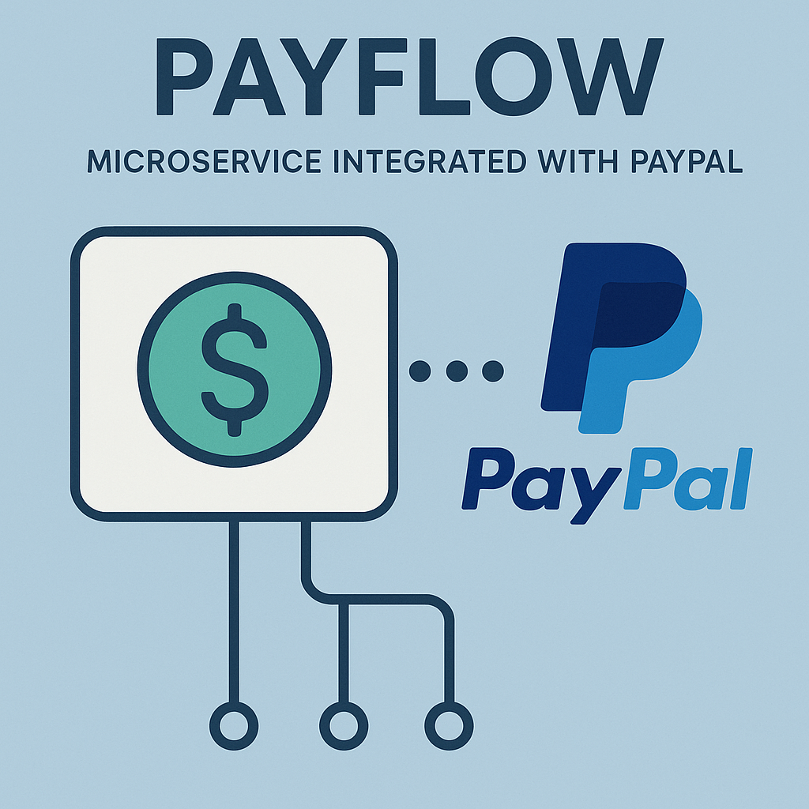

<div align="center">
  
  <h1>🚀 Payflow</h1>
  <p>Microservices-based application for user management and payment processing.</p>
</div>


---

## 📖 About the Project

Payflow is a microservices-based application developed in **Java** using **Spring Boot**. It integrates with **MySQL** for data persistence and the **PayPal API** for payment processing. The architecture is modular, with services for user management, payment handling, and exception management. The project also uses **JWT** for secure authentication.

---

## 🛠️ Technologies Used

-  **Java 17**: Programming language.
-  **Spring Boot**: Framework for building the application.
-  **Maven**: Dependency management and build tool.
-  **MySQL**: Relational database.
-  **JWT**: Authentication mechanism.
-  **PayPal SDK**: Integration with PayPal for payment processing.
-  **Lombok**: Reduces boilerplate code.
-  **Postman**: API testing tool.

---

## 🌐 API Routes

| **Endpoint**                    | **Method** | **Description**                 | **Authentication Required** |
|---------------------------------|------------|---------------------------------|-----------------------------|
| `/auth/login`                   | POST       | Login.                          | No                          |
| `/users`                        | GET        | Retrieves all users.            | Yes                         |
| `/users/{id}`                   | GET        | Retrieves a user by ID.         | Yes                         |
| `/users`                        | POST       | Creates a new user.             | No                          |
| `/users/{id}`                   | PUT        | Updates an existing user.       | Yes                         |
| `/users/{id}`                   | DELETE     | Deletes a user by ID.           | Yes                         |
| `/payments`                     | POST       | Creates a payment in PayPal.    | Yes                         |
| `/payments/{paymentId}`         | GET        | Retrieves payment details by ID.| Yes                         |
| `/payments/{paymentId}/execute` | POST       | Executes a PayPal payment.      | Yes                         |

---

## 📂 Postman Collection

A Postman collection is included in the project to facilitate API testing. It contains requests for:

- **User Management**: Create, retrieve, update, and delete users.
- **Authentication**: Login to generate JWT tokens.
- **Product Management**: Create and manage products.
- **Order Management**: Create and manage orders.
- **Payment Processing**: Create and execute PayPal payments.

The collection file is located in the project directory as `.postman_collection.json`.

---

## ⚠️ Exceptions

The project uses custom exceptions to handle errors effectively:

1. **`ResourceNotFoundException`**
    - **Description**: Thrown when a requested resource is not found.
    - **HTTP Status**: 404 (NOT FOUND).

2. **`BadRequestException`**
    - **Description**: Thrown when there is an error in the client request.
    - **HTTP Status**: 400 (BAD REQUEST).

3. **`UnauthorizedException`**
    - **Description**: Thrown when the client is not authenticated.
    - **HTTP Status**: 401 (UNAUTHORIZED).

4. **`ForbiddenException`**
    - **Description**: Thrown when the client lacks permission to access a resource.
    - **HTTP Status**: 403 (FORBIDDEN).

5. **`ConflictException`**
    - **Description**: Thrown when there is a conflict in the request, such as duplicate data.
    - **HTTP Status**: 409 (CONFLICT).

6. **`InternalServerErrorException`**
    - **Description**: Thrown when an unexpected server error occurs.
    - **HTTP Status**: 500 (INTERNAL SERVER ERROR).

7. **`PayPalServiceException`**
    - **Description**: Thrown when an error occurs while interacting with the PayPal service.
    - **HTTP Status**: 500 (INTERNAL SERVER ERROR).

---


## ⚙️ PayPal Configuration

To use the PayPal integration in this project, you need to have a PayPal account and follow these steps:

1. **Create a PayPal Developer Account**:  
   Visit the [PayPal Developer Portal](https://developer.paypal.com/) and log in with your PayPal account.

2. **Create an App**:
   - Navigate to the **Dashboard** and click on **Create App**.
   - Provide a name for your app and select the appropriate sandbox or live environment.
   - Once created, you will receive a **Client ID** and **Client Secret**.

3. **Configure the Application**:
   - Open the `application.yml` file located in `src/main/resources/`.
   - Replace the placeholders in the `paypal` section with your **Client ID** and **Client Secret**:

   ```yaml
   paypal:
     client-id: "your-client-id"
     client-secret: "your-client-secret"
     mode: sandbox
